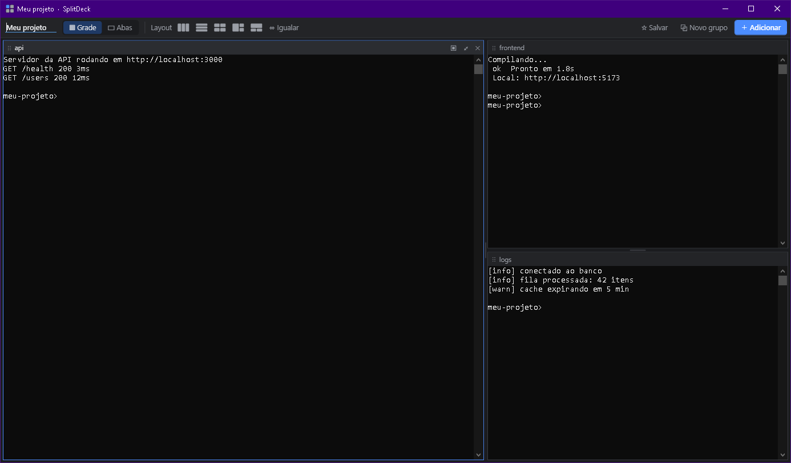

# Agrupa-Janela

Junte janelas de qualquer app do Windows em uma só janela, com painéis redimensionáveis.

[](https://github.com/brunocsilva41/agrupa-janela/actions/workflows/ci.yml)
[](https://github.com/brunocsilva41/agrupa-janela/releases/latest)
[](LICENSE)

<!-- Captura do grupo: será adicionada em docs/images/grupo.png -->
<!--  -->

## Por quê

Três terminais abertos lado a lado continuam sendo três janelas: cada uma precisa ser minimizada, movida e trazida para frente separadamente. O Agrupa-Janela coloca as janelas **reais** desses apps dentro de uma única janela "grupo". Você move, minimiza e organiza o grupo como se fosse uma janela só, e cada app continua funcionando normalmente dentro do seu painel.

Não é um emulador nem uma captura de tela: o app agrupado é o mesmo processo de antes. Ao desagrupar, a janela volta para a área de trabalho como estava.

## Recursos

- **Agrupa janelas de qualquer app** em uma janela "grupo" (terminais, Explorador de Arquivos, Bloco de Notas, navegadores, editores…).
- **Dois modos por painel**, escolhidos automaticamente e trocáveis à mão:
  - **Incorporada**: a janela vira parte do painel (terminais e apps clássicos);
  - **Acoplada**: a janela continua real e é mantida exatamente sobre o painel (apps que não se dão bem incorporados, como navegadores e apps que desenham com a GPU).
  A escolha manual fica lembrada por programa.
- **Layout em árvore** com divisórias arrastáveis, 5 layouts prontos, botão para igualar tamanhos, maximizar um painel (duplo clique no cabeçalho) e **modo abas**.
- **Reorganizar arrastando** o cabeçalho de um painel: soltar na borda de outro painel divide; soltar no centro troca os dois de lugar.
- **Várias formas de agrupar**: lista na janela principal, botão **＋ Adicionar** no grupo, atalho global, item **Agrupar…** no menu da barra de título dos apps e arrastar uma janela com **Shift** sobre um grupo ou sobre outra janela.
- **Atalhos globais** (Ctrl+Alt+tecla, com alternativa automática se a tecla estiver ocupada).
- **Grupos salvos**: layout e apps são lembrados; ao reabrir, o app reusa as mesmas janelas se ainda existirem ou abre os programas de novo.
- **Bandeja do sistema**, instância única, iniciar com o Windows, reabrir grupos salvos ao iniciar.
- **Protege suas janelas**: ao fechar, pergunta se deve devolver as janelas ou fechar os apps; em erro inesperado devolve tudo à área de trabalho; janelas acopladas escondidas por um encerramento forçado são recuperadas na próxima abertura.

## Instalação

O Agrupa-Janela roda no Windows 10 ou 11 (64 bits) e requer o **.NET 8 Desktop Runtime x64**.

Baixe a versão mais recente em [Releases](https://github.com/brunocsilva41/agrupa-janela/releases/latest). Cada versão traz três arquivos:

| Arquivo | Para quê |
|---|---|
| `AgrupaJanela-Setup-{versão}.exe` | Instalador |
| `AgrupaJanela-{versão}-win-x64.zip` | Versão portátil |
| `SHA256SUMS.txt` | Hashes SHA256 para conferir os dois arquivos acima |

### Instalador

1. Execute `AgrupaJanela-Setup-{versão}.exe`.
2. A instalação é só para o seu usuário e **não pede administrador**. O app vai para `%LOCALAPPDATA%\Programs\AgrupaJanela`.
3. Se o .NET 8 Desktop Runtime não estiver instalado, o instalador oferece baixar o instalador oficial da Microsoft.

### Portátil (ZIP)

1. Extraia `AgrupaJanela-{versão}-win-x64.zip` em uma pasta sua.
2. Execute `AgrupaJanela.exe`.
3. Se o .NET 8 Desktop Runtime não estiver instalado, baixe-o em <https://dotnet.microsoft.com/download/dotnet/8.0> (".NET Desktop Runtime", x64).

### Aviso do SmartScreen

O instalador e o executável **não são assinados digitalmente**. Por isso o Windows SmartScreen pode mostrar "O Windows protegeu o computador". Isso não significa que o arquivo seja malicioso, e sim que ele não tem assinatura de um editor conhecido.

Antes de clicar em **Mais informações → Executar assim mesmo**, confira se o arquivo é o mesmo publicado no release. No PowerShell, na pasta do download:

```powershell
Get-FileHash .\AgrupaJanela-Setup-1.0.0.exe -Algorithm SHA256
```

Compare o valor de `Hash` com a linha do mesmo arquivo em `SHA256SUMS.txt` (maiúsculas e minúsculas não fazem diferença). Se forem diferentes, **não execute** o arquivo e abra uma issue.

Se preferir não confiar em binários, [compile a partir do código](#compilar-a-partir-do-código).

## Como usar

<!-- Captura da janela principal: será adicionada em docs/images/principal.png -->
<!--  -->

1. Abra o Agrupa-Janela. A janela principal lista as **janelas abertas**.
2. Selecione uma ou mais (Ctrl+clique) e clique em **Novo grupo com as selecionadas**. Um duplo clique em uma janela agrupa na hora.
3. No grupo, ajuste os painéis arrastando as divisórias, escolha um layout pronto ou mude para **Abas**.
4. Para lembrar o grupo, clique em **☆ Salvar**. Ele aparece em **Grupos salvos** na janela principal e no menu da bandeja.
5. Para tirar uma janela do grupo, use o **✕** do cabeçalho do painel: o app continua aberto e volta para a área de trabalho.

Fechar a janela principal só a esconde: o app continua na bandeja, perto do relógio, com os atalhos ativos. Para encerrar, use **Sair** na janela principal ou no menu da bandeja.

### Atalhos globais

| Atalho | Ação |
|---|---|
| `Ctrl+Alt+G` | Agrupar a janela ativa (no último grupo usado, ou em um grupo novo) |
| `Ctrl+Alt+M` | Alternar o grupo entre grade e abas |
| `Ctrl+Alt+→` | Próximo painel |
| `Ctrl+Alt+←` | Painel anterior |
| `Ctrl+Alt+Enter` | Maximizar/restaurar o painel ativo |

Se outro programa já usa uma dessas combinações, o Agrupa-Janela registra a mesma tecla com `Ctrl+Alt+Shift`. Se as duas estiverem ocupadas, o atalho fica desativado. A janela principal mostra, em **Atalhos globais**, a combinação que está valendo.

### Formas de agrupar

| Forma | Como |
|---|---|
| Janela principal | Selecione na lista e use **Novo grupo com as selecionadas** ou **Adicionar a um grupo ▾**. |
| Dentro do grupo | **＋ Adicionar** lista as janelas abertas. |
| Atalho | `Ctrl+Alt+G` na janela que você quer agrupar. |
| Menu da barra de título | Clique com o botão direito na barra de título do app → **Agrupar janela** / **Agrupar em "…"** / **Agrupar em novo grupo**. Só em apps de janela clássica (veja [limitações](#limitações-conhecidas)). Pode ser desligado nas preferências. |
| Arrastar com Shift sobre um grupo | Arraste a janela pela barra de título segurando **Shift** e solte sobre o grupo; o destaque mostra onde ela vai cair. |
| Arrastar com Shift sobre outra janela | Solte sobre outra janela (fora de grupos) para criar um grupo novo com as duas, no lugar da janela de baixo. |

### Layouts

A barra do grupo tem 5 layouts prontos: **colunas**, **linhas**, **grade**, **principal à esquerda + pilha** e **principal em cima + lado a lado**. **⇔ Igualar** deixa todos os painéis do mesmo tamanho. Ao agrupar várias janelas de uma vez, o grupo começa dividido por igual (colunas até 3 janelas, grade a partir de 4).

### Preferências

Na janela principal, em **Preferências**:

- **Iniciar com o Windows (na bandeja)**: grava uma entrada em `HKCU\Software\Microsoft\Windows\CurrentVersion\Run`, só para o seu usuário.
- **Reabrir grupos salvos ao iniciar**.
- **"Agrupar" no menu da barra de título**.
- **Esconder esta janela depois de agrupar**.

## Modos Incorporada × Acoplada

Cada painel usa um de dois modos. O modo é escolhido automaticamente, e o botão **▣/◳** no cabeçalho do painel permite trocar na hora. A escolha manual fica salva para aquele programa (por nome do executável, ex.: `chrome.exe`); escolher **Automático** volta à regra padrão.

| | Incorporada (▣) | Acoplada (◳) |
|---|---|---|
| Como funciona | A janela do app vira filha do painel. | A janela do app continua independente e é mantida exatamente sobre o painel. |
| Melhor para | Terminais clássicos (cmd, PowerShell no conhost), Explorador de Arquivos, apps Win32 tradicionais e também navegadores Chromium e apps Electron (Chrome, Edge, Brave, VS Code, Discord, Docker Desktop…). | Reserva para apps que não se dão bem incorporados: Windows Terminal, Firefox, apps WPF, WinUI 3, UWP (Microsoft Store), Java e Qt. |
| Vantagem | Integração total: o app faz parte da janela do grupo. | Renderização, GPU, menus e atalhos do app ficam 100% nativos. |
| Cuidado | Se o processo do Agrupa-Janela for encerrado à força, o Windows pode fechar as janelas incorporadas junto. | Arrastar a janela do app para longe do painel (mais de ~80 px) a tira do grupo. |

Quando usar cada um: comece pelo automático. Se um app incorporado ficar com a imagem preta, piscando ou sem responder bem, troque para **Acoplada**. Se um app acoplado não acompanha bem o grupo e é um app clássico, experimente **Incorporada**.

Detalhes das regras automáticas: [docs/ARQUITETURA.md](docs/ARQUITETURA.md#regras-de-compatibilidade-embedpolicy).

## Privacidade e segurança

- **Sem coleta de dados.** Não há telemetria, conta ou análise de uso.
- **Rede:** a única conexão é a verificação de atualizações nos Releases do GitHub (`api.github.com`), que pode ser desligada nas preferências. Ela acontece no máximo uma vez por dia, e também pode ser feita manualmente (bandeja ou janela principal → "Verificar atualizações").
- **Sem administrador:** o app roda com os privilégios do seu usuário (`asInvoker`).
- **Sem injeção de código:** o app não carrega DLLs nem código em outros processos. Ele usa só APIs públicas do Windows sobre as janelas (posição, pai, estilo, menu de sistema) e ganchos de eventos *out-of-context*.
- **Atualizações verificadas:** o app só baixa do repositório oficial, confere o SHA-256 publicado no release antes de executar o instalador e pergunta antes de atualizar. Antes de trocar os arquivos, devolve todas as janelas agrupadas.
- **Dados locais**, em `%APPDATA%\AgrupaJanela` (ou na pasta indicada pela variável de ambiente `AGRUPAJANELA_DATA`, útil para uso portátil e testes — ela também isola a instância):
  - `settings.json`: preferências e o modo escolhido por programa;
  - `groups.json`: grupos salvos. Inclui, para cada painel, o caminho do executável, os argumentos da linha de comando e o título da janela, usados para reabrir o app. Argumentos com cara de senha/token (`password`, `token`, `secret`, `api-key`, `-p…`, `usuario:senha@`) **não são gravados** — o app reabre sem eles;
  - `recovery.json`: lista temporária de janelas acopladas, usada para recuperá-las após um encerramento forçado.
- Ao reabrir um grupo salvo, o app só relança executáveis locais com **caminho absoluto** terminado em `.exe` que ainda existem (nada de pastas de rede nem nomes resolvidos pelo `PATH`; apps da Microsoft Store são abertos pelo alias oficial). Rodando como administrador, ele **não relança nada** a partir do arquivo, só reencontra janelas já abertas.

Para relatar vulnerabilidades, veja [SECURITY.md](SECURITY.md).

## Limitações conhecidas

- **Apps rodando como administrador** não podem ser agrupados por um Agrupa-Janela não elevado (o Windows bloqueia). Eles aparecem na lista como indisponíveis. A alternativa é abrir o próprio Agrupa-Janela como administrador.
- **Apps que não estão respondendo** também aparecem como indisponíveis até voltarem a responder.
- **Menu da barra de título:** apps com barra de título própria (Chrome, Windows Terminal, VS Code…) desenham o próprio menu e **não mostram** o item "Agrupar". Use o atalho, a lista ou o arraste com Shift.
- **Encerramento forçado** do Agrupa-Janela (Gerenciador de Tarefas, `taskkill /f`) pode fechar as janelas que estavam no modo **Incorporada**, porque o Windows destrói janelas filhas junto com a janela pai. Janelas acopladas não morrem junto e são mostradas de volta na próxima abertura. Em erros normais e ao desligar o Windows, o app devolve as janelas antes de sair.
- **Grupos salvos** dependem de o app reabrir com os mesmos argumentos e mostrar uma janela nova em até 15 segundos; apps que não se comportam assim podem não ser restaurados (o grupo informa quantos foram).
- **Instalador não assinado**: veja [Aviso do SmartScreen](#aviso-do-smartscreen).

## Compilar a partir do código

Requisitos: Windows 10/11 e [.NET SDK 8](https://dotnet.microsoft.com/download/dotnet/8.0).

```powershell
git clone https://github.com/brunocsilva41/agrupa-janela.git
cd agrupa-janela
dotnet build AgrupaJanela.sln
dotnet test tests/AgrupaJanela.Tests
```

Para gerar o instalador e o ZIP localmente:

```powershell
./build/package.ps1 -Version 1.0.0
```

Os releases são publicados automaticamente pelo GitHub Actions quando uma tag `vX.Y.Z` é enviada ao repositório.

## Estrutura do repositório

```text
AgrupaJanela.sln
src/AgrupaJanela/          app WPF (.NET 8, x64)
  App.xaml(.cs)            início: instância única, proteção contra erros
  AppController.cs         coordena grupos, atalhos, arraste, bandeja
  GroupWindow.xaml(.cs)    a janela "grupo"
  MainWindow.xaml(.cs)     a janela principal
  Hosting/                 incorporar/acoplar janelas, regras de modo, reabrir apps
  Layout/                  árvore de layout e indicador de soltura
  Native/Win32.cs          declarações P/Invoke compartilhadas
  Persistence/             preferências e grupos salvos
  Shell/                   atalhos, menu da barra de título, arraste, bandeja, diálogos
  Themes/Dark.xaml         tema escuro
src/AgrupaJanela.Setup/    instalador (WPF sobre .NET Framework 4.8, um único .exe)
tests/AgrupaJanela.Tests/  testes automatizados
build/package.ps1          empacotamento (instalador + ZIP)
docs/                      documentação (ARQUITETURA.md)
.github/                   modelos de issue/PR, CODEOWNERS, workflows
```

A arquitetura está descrita em [docs/ARQUITETURA.md](docs/ARQUITETURA.md).

## Contribuir

Contribuições são bem-vindas, por Pull Request revisado pelo mantenedor. Leia [CONTRIBUTING.md](CONTRIBUTING.md) (inclui o DCO e a regra de ouro: nenhuma mudança pode arriscar perder janelas do usuário) e o [Código de Conduta](CODE_OF_CONDUCT.md).

## Licença

[MIT](LICENSE) © 2026 Bruno Silva.

---

## English summary

**Agrupa-Janela** groups real windows from any Windows app into a single "group" window with resizable panes. Each pane either **embeds** the window (reparented as a child — best for classic terminals and Win32 apps) or **docks** it (the window stays top-level and is kept exactly over the pane — best for browsers, Electron and GPU-rendered apps). The mode is chosen automatically and can be switched per pane; the choice is remembered per program.

Features: tree layout with draggable splitters, 5 presets, equalize, maximize pane, drag-to-rearrange, tabs mode, global hotkeys (`Ctrl+Alt+G/M/←/→/Enter`, falling back to `Ctrl+Alt+Shift`), a "Group…" item in classic apps' title-bar menu, Shift+drag a window onto a group or onto another window, saved groups, tray icon, start with Windows. On close or on errors, windows are handed back to the desktop.

Install: per-user installer (no admin) into `%LOCALAPPDATA%\Programs\AgrupaJanela`, or portable ZIP. Requires the .NET 8 Desktop Runtime x64. Binaries are not code-signed; verify them with `SHA256SUMS.txt` from the release. No telemetry; the only network access is the update check against GitHub Releases (being implemented, can be turned off). Limitations: elevated (admin) windows can't be grouped by a non-elevated instance; apps with custom title bars don't show the title-bar menu item; force-killing the process may close embedded windows.

Build: `dotnet build AgrupaJanela.sln`, test: `dotnet test tests/AgrupaJanela.Tests`. License: MIT. The UI and docs are in Brazilian Portuguese.
