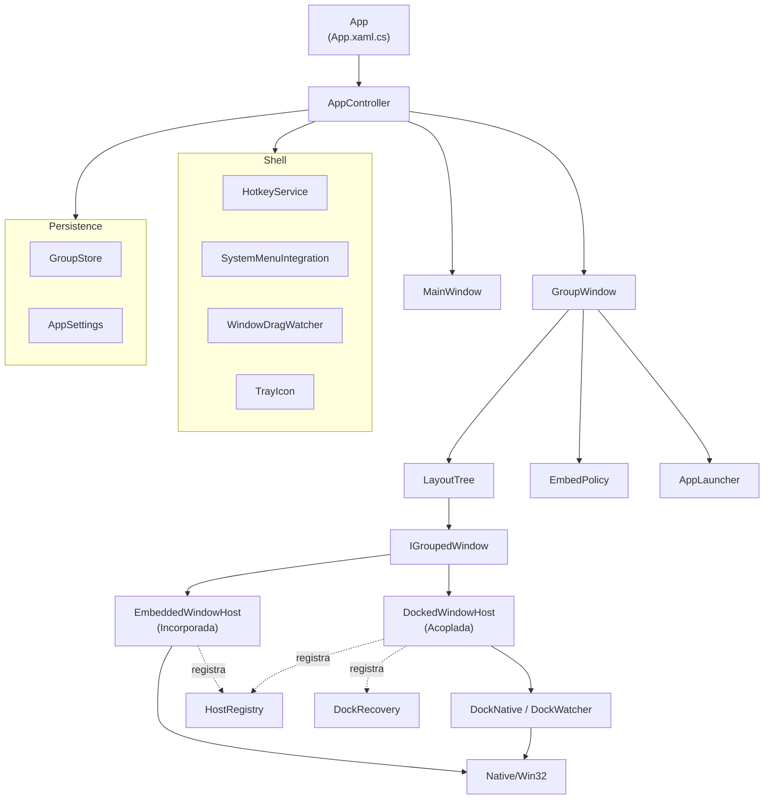

# Arquitetura

O SplitDeck é um app WPF (.NET 8, x64) que coloca janelas de **outros processos** dentro de uma janela própria, o "grupo". Este documento descreve as peças, os fluxos principais e o porquê das decisões. Os nomes citados são classes e arquivos reais de `src/AgrupaJanela`.

## Visão geral

| Peça | Arquivo | Papel |
|---|---|---|
| `App` | `App.xaml.cs` | Instância única (mutex + evento "Show"), evento "Quit" para o instalador/atualizador, tratamento de erros que devolve todas as janelas, início do `AppController`. |
| `AppController` | `AppController.cs` | Um por processo. Cria e acompanha grupos, grupos salvos, atalhos, arraste com Shift, menu da barra de título, bandeja e encerramento. |
| `MainWindow` | `MainWindow.xaml(.cs)` | Lista de janelas abertas, grupos abertos e salvos, atalhos ativos e preferências. Fechar só esconde. |
| `GroupWindow` | `GroupWindow.xaml(.cs)` | A janela "grupo": barra (nome, grade/abas, layouts, salvar, adicionar), painéis, arrastar cabeçalhos, troca de modo, salvar/reabrir. |
| `LayoutTree` | `Layout/LayoutTree.cs` | Árvore de divisões (`SplitNode` com pesos, `LeafNode` com um `IGroupedWindow`), layouts prontos e serialização (`NodeDto`). |
| `DropOverlay` | `Layout/DropOverlay.cs` | Janela transparente, sem foco e que deixa o clique passar, que destaca onde algo vai cair. |
| `IGroupedWindow` | `Hosting/IGroupedWindow.cs` | Contrato comum de uma janela agrupada, em qualquer modo: `Target`, `Identity`, `Mode`, `View`, `Release()`. |
| `EmbeddedWindowHost` | `Hosting/EmbeddedWindowHost.cs` | Modo Incorporada (`HwndHost` + HWND "wrapper"). Também contém `HostRegistry`. |
| `DockedWindowHost` | `Hosting/DockedWindowHost.cs` | Modo Acoplada (elemento WPF que é só o "lugar" da janela). Também contém `DockRecovery`. |
| `DockNative`, `DockWatcher` | `Hosting/DockSync.cs` | Posicionamento, ordem Z, botão da barra de tarefas e ganchos WinEvent por processo para as acopladas. |
| `EmbedPolicy` | `Hosting/EmbedPolicy.cs` | Decide o modo de cada janela. |
| `WindowCatalog` | `Hosting/WindowCatalog.cs` | Lista janelas agrupáveis e explica por que outras não podem ser agrupadas (`BlockReason`). |
| `AppIdentity`, `AppLauncher` | `Hosting/` | O que é salvo de cada app (executável, argumentos, título, último HWND e PID) e como reencontrá-lo ou relançá-lo. |
| `HotkeyService` | `Shell/HotkeyService.cs` | Atalhos globais numa janela só de mensagens. |
| `SystemMenuIntegration` | `Shell/SystemMenuIntegration.cs` | Itens "Agrupar…" no menu de sistema de outros apps. |
| `WindowDragWatcher` | `Shell/WindowDragWatcher.cs` | Detecta arraste de janelas de outros apps. |
| `TrayIcon` | `Shell/TrayIcon.cs` | Ícone da bandeja (WinForms `NotifyIcon`). |
| `GroupStore`, `AppSettings`, `AppPaths` | `Persistence/` | `groups.json` e `settings.json` em `%APPDATA%\SplitDeck` (ou `SPLITDECK_DATA`); nomes da instância única e dos sinais (`Local\SplitDeck.{SID}`, `.Show`, `.Quit`); "Iniciar com o Windows" em `HKCU\...\Run`. |
| `UpdateService` | `Updates/` | Verificação e aplicação de atualizações pelos Releases do GitHub, com SHA-256. |
| `Win32` | `Native/Win32.cs` | Declarações P/Invoke compartilhadas. |

## Fluxos principais

### Agrupar

1. Uma das entradas pede para agrupar: lista da `MainWindow`, **＋ Adicionar** do grupo, `HotkeyService` (`Ctrl+Alt+G`), `SystemMenuIntegration` ou `WindowDragWatcher` (arraste com Shift).
2. `WindowCatalog.Describe` confere a janela na hora: visível, sem dono, não é filha nem janela de ferramenta, não é do próprio app nem do shell (área de trabalho, barra de tarefas), tem título. Se o app está travado ou é elevado (e o SplitDeck não), a janela recebe um `BlockReason` e não é agrupada.
3. `AppController.AddTo` recusa janelas que já estão em outro grupo (`OwnerOf`).
4. `GroupWindow.TryAdd` → `CreateHost`: `EmbedPolicy.Resolve` escolhe o modo e é criado um `EmbeddedWindowHost` ou `DockedWindowHost`. Se a criação falha, a exceção vira mensagem para o usuário e nada é alterado na janela.
5. O host entra na `LayoutTree` ao lado do painel ativo (dividindo no sentido mais comprido) ou na zona de soltura escolhida, e o grupo é redesenhado (`Rebuild`).

**Incorporada** (`EmbeddedWindowHost.Attach`): guarda estilo, estilo estendido e posição (`WINDOWPLACEMENT`); restaura a janela se estiver minimizada/maximizada; troca o estilo para `WS_CHILD` (sem moldura) **antes** do `SetParent`, como pede a documentação; faz `SetParent` para o wrapper e, se o Windows recusar, restaura o estilo e informa o erro.

**Acoplada** (`DockedWindowHost`): guarda a posição, passa a vigiar o processo (`DockWatcher.Track`), registra a janela em `DockRecovery` e a posiciona sobre o painel sempre que o layout muda (`Sync`), escondendo-a quando o painel sai da tela (aba inativa, outro painel maximizado, grupo minimizado). O botão da janela na barra de tarefas é retirado (`ITaskbarList`).

### Devolver

Todo caminho de saída chama `IGroupedWindow.Release()`, que é idempotente:

- **Incorporada:** `SetParent(0)`, restaura estilo, estilo estendido e posição originais (minimizada volta como normal) e mostra a janela.
- **Acoplada:** para de vigiar, sai de `DockRecovery`, restaura a posição (ou mantém onde está, se foi arrastada para fora), mostra a janela e devolve o botão da barra de tarefas.

Quem dispara:

- **✕** no painel, arrastar uma acoplada para longe (mais de 80 px), mover para outro grupo: `GroupWindow.Remove` / `ReleaseForMove`.
- **Fechar o grupo:** `GroupWindow.OnClosing` pergunta (devolver ou fechar os apps) e devolve tudo **antes** de o HWND do grupo ser destruído. "Fechar os apps" envia `WM_CLOSE` a cada app, depois de devolvido.
- **Sair / desligar o Windows:** `AppController.Exit` pergunta uma vez para todos os grupos; `ExitSilently` (fim de sessão do Windows ou evento "Quit") devolve sem perguntar.
- **Erro inesperado:** `App` chama `HostRegistry.ReleaseAll()` em `DispatcherUnhandledException`, `UnhandledException`, `ProcessExit` e `OnExit`.
- **Janela fechada pelo próprio app:** o timer de 1 s do grupo (`Watch`) tira da árvore os hosts que não estão mais ligados e atualiza os títulos.
- **Encerramento forçado:** não há código que rode. Janelas acopladas continuam existindo (sem dono entre processos), mas podem ter ficado escondidas; na próxima abertura, `DockRecovery.RecoverOrphans` mostra de novo as que ainda pertencem ao mesmo processo. Janelas incorporadas podem ser destruídas junto com o grupo pelo Windows: é a limitação conhecida do modo.

### Salvar e reabrir

1. **☆ Salvar** liga `IsSaved`; a partir daí, cada mudança do usuário no grupo (`Changed` com `persist: true`) regrava o grupo em `groups.json` via `GroupStore.Save` (grava em `.tmp` e move por cima, para não corromper o arquivo). Mudanças que não vêm do usuário (app fechado por fora, fechamento do grupo) usam `persist: false` e preservam o layout salvo, para não "esquecer" apps.
2. `SavedGroup` guarda nome, modo abas, `NodeDto` do layout (com um `AppIdentity` por folha), posição, tamanho e se estava maximizado.
3. **Reabrir** (`GroupWindow.LoadAsync`), para cada app, em ordem: `AppLauncher.ResolveAsync` usa a mesma janela se o HWND ainda existe **e** é do mesmo processo; senão relança o executável com os mesmos argumentos e espera até 15 s por uma janela nova (primeiro do processo lançado, depois do mesmo executável, para apps que repassam para outra instância). Folhas sem app resolvido são descartadas da árvore montada, e o grupo informa quantos apps voltaram.
4. Se o arquivo estiver corrompido, `GroupStore` guarda uma cópia `groups.json.bak` e começa vazio.

### Atualização

`Updates/UpdateService.cs` consulta `api.github.com/repos/brunocsilva41/agrupa-janela/releases/latest` (no máximo 1x por dia, 20 s depois de abrir, se "Verificar atualizações automaticamente" estiver ligado; ou manualmente). Releases rascunho/pré-lançamento são ignorados. Se houver versão maior:

1. pergunta ao usuário (Atualizar agora / Ver novidades / Pular esta versão / Depois);
2. baixa `SHA256SUMS.txt` e `SplitDeck-Setup-{versão}.exe` **só** de `github.com/brunocsilva41/agrupa-janela/releases/download/` (limite de 200 MB);
3. confere o SHA-256; se não bater, apaga e cancela;
4. inicia o instalador com `--update --silent --wait-pid <pid> --relaunch`, devolve todas as janelas (`ExitSilently`) e sai. O instalador espera o processo sair, instala por cima e reabre o app.

Na versão portátil (sem `Setup.exe` ao lado do executável), o app só oferece abrir a página do release.

O que também existe para isso: o evento nomeado "Quit" (`AppPaths.QuitEventName`), que o instalador/atualizador aciona para que o app em execução **devolva todas as janelas sem perguntar e encerre** (`App.OnStartup` → `AppController.ExitSilently`). O instalador (`src/AgrupaJanela.Setup`) embute o pacote do app e grava o SHA256 desse pacote no próprio assembly, para conferir a integridade antes de extrair.

## Decisões e porquês

### Por que `HwndHost` com um HWND "wrapper"

A janela incorporada não é colocada diretamente no `HwndHost`. `EmbeddedWindowHost` cria uma janela `Static` própria (o wrapper), devolve **ela** em `BuildWindowCore` e faz a janela do outro app virar filha do wrapper.

- Quando o `HwndHost` é descartado, o WPF chama `DestroyWindowCore` para destruir o HWND devolvido em `BuildWindowCore`, e destruir uma janela destrói também as filhas dela. Com o wrapper, o HWND destruído é nosso: `DestroyWindowCore` primeiro chama `Release()`, que devolve a janela do app, e só então destrói o wrapper.
- O WPF posiciona e dimensiona o wrapper; o `WndProc` do wrapper repassa o `WM_SIZE` para a janela do app em pixels físicos, com `SWP_ASYNCWINDOWPOS` para não travar a interface se o app estiver travado.
- O wrapper é criado com `DPI_HOSTING_BEHAVIOR_MIXED` (Windows 10 1803+), o que permite hospedar janelas com modo de DPI diferente do nosso.
- `WS_CLIPCHILDREN` e `SS_NOTIFY` no wrapper; os cliques na janela filha chegam como `WM_PARENTNOTIFY` e marcam o painel ativo.

Como o WPF não desenha por cima de HWNDs filhos (problema de *airspace*), o destaque de soltura é uma janela separada (`DropOverlay`), transparente e topmost.

### Por que o modo Acoplada não usa dono (owner) entre processos

Definir o grupo como *owner* da janela acoplada manteria a ordem Z de graça, mas liga o destino das duas janelas: se o processo do SplitDeck morrer, o Windows destrói as janelas que ele possui. Por isso a janela acoplada continua top-level e sem dono, e a ordem Z é mantida à mão (`DockNative.PlaceAbove`, `GroupWindow.ArrangeUnder`): ao ativar o grupo, as acopladas sobem logo acima dele; ao ativar uma acoplada, o grupo desce logo abaixo dela. O custo é mais código; o ganho é que um encerramento forçado não fecha esses apps.

Outros cuidados do modo:

- O frame **visível** (`DWMWA_EXTENDED_FRAME_BOUNDS`) é alinhado ao painel; as bordas invisíveis variam por app e por DPI e são medidas na hora (`FitVisibleFrame`).
- Nossos próprios `SetWindowPos` geram eventos de movimento; `DockWatcher.NoteOwnMove` ignora esse eco por ~200 ms.
- `ShowWindow` em app travado usa `ShowWindowAsync`; `PlaceAbove` usa `SWP_ASYNCWINDOWPOS`.

### Por que WinEvent *out-of-context*, sem injeção

Ganchos *in-context* (os ganchos globais de `SetWindowsHookEx`, exceto os *low-level*, e o WinEvent *in-context*) exigem carregar uma DLL nossa dentro de cada processo observado. Isso é invasivo, pode desestabilizar outros apps e costuma ser bloqueado por antivírus. O app usa só `SetWinEventHook` com `WINEVENT_OUTOFCONTEXT`: o Windows entrega os eventos na thread de UI do SplitDeck.

- `WindowDragWatcher`: `EVENT_SYSTEM_MOVESIZESTART/END` de todos os processos (menos o nosso), com um timer de 40 ms lendo o cursor e o Shift só durante o arraste.
- `DockWatcher`: ganchos **por processo** acoplado (nunca globais) e faixas estreitas de eventos, para não receber o tráfego de cada controle do app. Eventos de posição são agrupados (no máximo um por janela a cada ~30 ms). Exceções no callback são capturadas, porque subiriam para código nativo e derrubariam o processo.
- `SystemMenuIntegration`: acrescenta itens ao menu de sistema quando a janela vem para frente; descobre o dono do menu por `EVENT_SYSTEM_MENUSTART` e o item escolhido por `EVENT_OBJECT_INVOKED`. O app dono ignora o `WM_SYSCOMMAND` com um ID que não conhece. Ao sair, remove **só os próprios itens** (nunca "reseta" o menu, o que apagaria itens do app).
- Os delegates dos callbacks ficam guardados em campos, para o GC não coletá-los.

### Segurança fail-closed

Quando o app não tem certeza, ele não age:

- não agrupa janelas de apps travados nem de processos elevados (se ele próprio não for elevado);
- `AppLauncher` só relança caminhos absolutos terminados em `.exe` que existem (apps da Store em `WindowsApps` são abertos pelo alias via shell); nada resolvido pelo `PATH`;
- reaproveitar uma janela salva ou recuperar uma órfã exige o mesmo HWND **e** o mesmo PID, porque o Windows reutiliza handles;
- nunca pega "uma janela qualquer do mesmo programa" ao reabrir um grupo: só janelas novas, surgidas depois do lançamento;
- em erro, devolve as janelas (`HostRegistry.ReleaseAll`) antes de mostrar a mensagem;
- falhas ao gravar preferências, recuperação ou menus não derrubam o app.

## Regras de compatibilidade (EmbedPolicy)

`EmbedPolicy.Decide` escolhe o modo nesta ordem; a primeira regra que casa vence:

1. **Escolha do usuário** salva em `settings.json` (`AppSettings.EmbedOverrides`, chave = nome do executável em minúsculas).
2. **Classe da janela** (`DockClasses`, depois regras específicas para Qt, Chromium/Electron (`Chrome_WidgetWin_*` → Incorporada — testado com Brave, Docker Desktop e outros), `ConsoleWindowClass` e `PseudoConsoleWindow`).
3. **Nome do processo** (`WindowsTerminal.exe` → Acoplada, `explorer.exe` → Incorporada).
4. **Filho típico de GPU** (`GpuChildClasses`: `Intermediate D3D Window`), procurado em até 200 janelas filhas.
5. **Padrão:** Incorporada.

A razão de cada decisão aparece no menu de modo do painel (opção **Automático**), por isso toda regra tem um texto curto e amigável.

### Como adicionar uma regra

1. **Descubra a classe da janela** do app, por exemplo com o Spy++, que acompanha o Visual Studio (carga de trabalho de C++).
2. **Escolha o tipo de regra:**
   - classe exata ou prefixo → uma linha em `DockClasses`: `("NomeDaClasse", prefixo, "Nome do app: acoplada porque …")`;
   - classe de janela filha que indica renderização por GPU → um item em `GpuChildClasses`;
   - app que só dá para reconhecer pelo executável, ou que deve ser **Incorporada** apesar de uma regra genérica → um `if` em "2b) Processo", antes da checagem de filhos de GPU.
3. **Escreva a razão** em português, curta, dizendo o app e o porquê (ela é mostrada ao usuário).
4. **Teste à mão** com o app real nos dois modos e confirme que devolver a janela funciona.
5. **Adicione um teste** em `tests/AgrupaJanela.Tests/Hosting/EmbedPolicyTests.cs`, quando a regra puder ser verificada sem uma janela real.
6. No PR, diga a versão do app testada e o motivo da regra (o que dá errado no outro modo).

Prefira regras específicas a regras amplas: uma regra que casa demais muda o comportamento de apps que já funcionavam.
